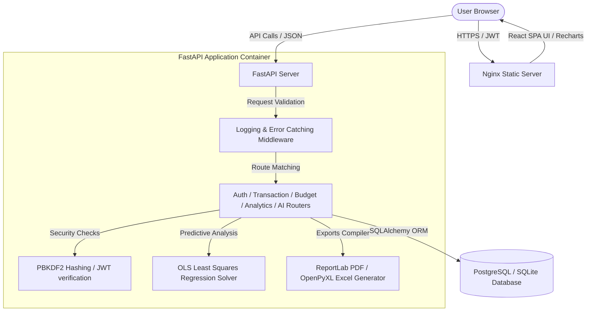

# Centio.ai - Smart Expense Tracker with Analytics & AI Insights

Centio.ai is a resume-worthy, production-ready Final-Year College Project. It is a premium web application engineered for personal financial management, featuring real-time analytics dashboards, category budget trackers, PDF reports, and predictive expense forecasting powered by hand-coded Ordinary Least Squares (OLS) linear regression.

---

## 🏗️ Architecture Design & System Flow



---

## 📂 Project Structure

```
expence-tracker/
├── backend/
│   ├── app/
│   │   ├── database/
│   │   │   └── session.py        # Connection pools and SQLite foreign keys enforcement
│   │   ├── models/
│   │   │   ├── user.py           # SQLAlchemy User entity
│   │   │   ├── transaction.py    # SQLAlchemy Income/Expense transaction entity
│   │   │   └── budget.py         # SQLAlchemy category limits entity
│   │   ├── schemas/
│   │   │   ├── user.py           # Pydantic auth schemas
│   │   │   ├── transaction.py    # Pydantic CRUD transaction validators
│   │   │   ├── budget.py         # Pydantic budget progress schemas
│   │   │   └── ai.py             # Pydantic forecasting schemas
│   │   ├── routers/
│   │   │   ├── auth.py           # Login, register, profile, recovery paths
│   │   │   ├── transactions.py    # CRUD transactions (filter, sort, search)
│   │   │   ├── budgets.py        # CRUD budgets (current_spent aggregation)
│   │   │   ├── analytics.py      # Aggregates, CSV/Excel/PDF download responses
│   │   │   └── ai.py             # Forecast & Insights endpoints
│   │   ├── services/
│   │   │   ├── ai_service.py     # Least Squares OLS math projections solver
│   │   │   └── report_service.py # openpyxl / reportlab export generators
│   │   ├── middleware/
│   │   │   └── logging.py        # Performance logging & safe 500 responders
│   │   ├── utils/
│   │   │   ├── config.py         # Pydantic BaseSettings loading
│   │   │   └── security.py       # Custom PBKDF2 hash & JWT token creation
│   │   └── main.py               # FastAPI entry app initialization
│   ├── tests/
│   │   ├── conftest.py           # Pytest context (isolated SQLite memory database)
│   │   ├── test_auth.py          # Auth validation suites
│   │   ├── test_transactions.py  # CRUD transaction suites
│   │   ├── test_budgets.py       # Budget ceilings suites
│   │   └── test_ai.py            # AI mathematical projection tests
│   ├── Dockerfile
│   └── requirements.txt
├── frontend/
│   ├── src/
│   │   ├── assets/
│   │   ├── components/
│   │   │   ├── Layout.jsx           # App top bar navigation panel
│   │   │   ├── GlassCard.jsx        # Framer Motion animated cards
│   │   │   ├── SkeletonLoader.jsx   # Skeletal pulsing widgets
│   │   │   ├── Toast.jsx            # Toast notifications manager
│   │   │   ├── TransactionForm.jsx  # CRUD transaction popup
│   │   │   ├── BudgetForm.jsx       # Budget ceiling popup
│   │   │   └── DashboardWidgets.jsx # Value widgets grid
│   │   ├── context/
│   │   │   └── AuthContext.jsx      # Theme, notifications, login states
│   │   ├── pages/
│   │   │   ├── LandingPage.jsx      # Parallax Scrolling landing page
│   │   │   ├── Login.jsx            # Sign in interface
│   │   │   ├── Register.jsx         # Sign up interface
│   │   │   ├── ForgotPassword.jsx   # simulated recovery email loader
│   │   │   ├── Dashboard.jsx        # Summary graphs, alert list, logs
│   │   │   ├── Transactions.jsx     # Search & Filter grid logs
│   │   │   ├── Budgets.jsx          # Progress limits cards
│   │   │   ├── Analytics.jsx        # Recharts visualizations & downloads
│   │   │   └── AIInsights.jsx       # Forecast projections & strategy tips
│   │   ├── services/
│   │   │   └── api.js               # Service calls provider
│   │   ├── styles/
│   │   │   ├── variables.css        # CSS Theme Tokens
│   │   │   ├── global.css           # Global layout & modern scrollbars
│   │   │   ├── glass.css            # Glassmorphic inputs/buttons/tables
│   │   │   └── animations.css       # Keyframes & Parallax scroll definitions
│   │   ├── App.jsx                  # Tab routes coordinator
│   │   └── main.jsx                 # React root mounting
│   ├── Dockerfile
│   ├── package.json
│   └── vite.config.js
├── docker-compose.yml
├── init-db.sql
└── README.md
```

---

## 🚀 Installation & Local Run Guide

### Option 1: Docker Compose (Zero Configuration Run)
Ensure you have Docker and Docker Compose installed:
1. In the project root, run:
   ```bash
   docker-compose up --build
   ```
2. Once complete, access:
   - **Frontend App**: [http://localhost](http://localhost) (Nginx proxy)
   - **Backend OpenAPI docs**: [http://localhost:8000/docs](http://localhost:8000/docs)

---

### Option 2: Direct Local Setup (Manual Running)

#### Step 1: Run the Backend
1. Navigate to the `backend/` directory:
   ```bash
   cd backend
   ```
2. Create and activate a Python virtual environment:
   ```bash
   python -m venv venv
   # On Windows:
   venv\Scripts\activate
   # On MacOS/Linux:
   source venv/bin/activate
   ```
3. Install dependencies:
   ```bash
   pip install -r requirements.txt
   ```
4. Copy `.env.example` as `.env` and fill values (or use default SQLite fallback):
   ```bash
   copy .env.example .env
   ```
5. Run the development server:
   ```bash
   uvicorn app.main:app --reload --port 8000
   ```
   *The server will start on [http://localhost:8000](http://localhost:8000)*

#### Step 2: Run the Frontend
1. Open a new terminal and navigate to the `frontend/` directory:
   ```bash
   cd frontend
   ```
2. Install Node packages:
   ```bash
   npm install
   ```
3. Run the Vite development server:
   ```bash
   npm run dev
   ```
   *The React app will boot up on [http://localhost:5173](http://localhost:5173)*

---

## 📝 API Documentation

| Method | Endpoint | Description | Authentication | Request JSON |
|:---|:---|:---|:---|:---|
| **POST** | `/api/v1/auth/register` | Sign up a new user | Public | `{"email", "password"}` |
| **POST** | `/api/v1/auth/login` | Authenticate & get JWT token | Public | `{"email", "password"}` |
| **GET** | `/api/v1/auth/me` | Fetch active user credentials | Bearer Token | - |
| **GET** | `/api/v1/transactions/` | List, query, sort transactions | Bearer Token | Query Params: `type`, `category`, `search`, `sort_by` |
| **POST** | `/api/v1/transactions/` | Add transaction record | Bearer Token | `{"type", "category", "amount", "notes", "tags"}` |
| **PUT** | `/api/v1/transactions/{id}` | Edit transaction details | Bearer Token | `{"amount", "notes", "tags"}` |
| **DELETE** | `/api/v1/transactions/{id}`| Remove transaction record | Bearer Token | - |
| **GET** | `/api/v1/budgets/` | List active budgets with progress | Bearer Token | - |
| **POST** | `/api/v1/budgets/` | Establish a category budget limit | Bearer Token | `{"category", "amount", "period"}` |
| **GET** | `/api/v1/analytics/summary` | Balance sheet totals & savings rate | Bearer Token | - |
| **GET** | `/api/v1/analytics/export/pdf` | Download formatted statement PDF | Bearer Token | - |
| **GET** | `/api/v1/ai/forecast` | Next-month regression forecasts | Bearer Token | - |
| **GET** | `/api/v1/ai/insights` | Compile warnings & savings tips | Bearer Token | - |

---

## 🧪 Testing Guide

We write automated test suites using `pytest`. The system handles database testing by spinning up an isolated, temporary **in-memory SQLite database** and overriding API dependencies.

1. Navigate to the `backend/` folder:
   ```bash
   cd backend
   ```
2. Execute the tests:
   ```bash
   pytest -v
   ```
3. Execution checks:
   - Validates that token validations and profile guards block intruders.
   - Asserts CRUD limits on income/expense tables.
   - Tests budget calculations and linear forecasting math boundaries.

---

## 🎓 Final Year College Project Viva Q&A

### Q1: What makes your forecasting feature "AI-based"?
> **Answer**: Instead of using bloated third-party cloud wrappers, we built a statistical prediction engine directly into the backend using the **Ordinary Least Squares (OLS) method for Simple Linear Regression**. It maps chronological data onto an $x$-axis representing time offsets (days) and a $y$-axis representing daily total outlays. By solving for slope ($m$) and intercept ($c$) using the formula:
> $$m = \frac{N\sum(xy) - \sum x \sum y}{N\sum(x^2) - (\sum x)^2}$$
> it fits a line $y = mx + c$ onto historical trends to project future day-by-day expenditure paths for the next 30 days.

### Q2: How did you implement input security and secure password hashing?
> **Answer**: All request inputs are strictly validated at the API layer using Pydantic schemas (e.g. enforcing data-types, emails formatting, and positive bounds on amount limits). Passwords are never stored in plain text. We utilize a custom implementation of **PBKDF2 (Password-Based Key Derivation Function 2) with SHA-256** and a unique random 16-byte salt per user. This is an industry-standard mechanism resistant to rainbow-table and dictionary-based decryption attacks.

### Q3: Why did you choose React (Vite) + FastAPI over other stacks?
> **Answer**: 
> - **FastAPI** is a modern high-performance Python framework. It compiles automatic OpenAPI documentation and supports async processing, resulting in incredibly low latency response times.
> - **Vite** compile speeds are up to 10-100x faster than traditional Webpack builders.
> - **React** handles components rendering declaratively, resulting in instant page refreshes when managing dynamic charts (via Recharts) and custom glassmorphism components.

### Q4: How is database integrity maintained between SQLite and PostgreSQL?
> **Answer**: We utilize **SQLAlchemy ORM** to decouple code operations from physical database scripts. It automatically compiles standard dialects for SQLite (local testing) and PostgreSQL (production). In SQLite connection hooks, we listen to engine bindings to explicitly execute `PRAGMA foreign_keys=ON`, which ensures that deleting a user automatically cleans up cascading transaction records in SQLite, just like PostgreSQL does naturally.

---

## 📄 SDE Resume Project Description

### Centio.ai | Full-Stack Software Engineering Project
* **Core Technologies**: React.js, Vite, FastAPI (Python), PostgreSQL, SQLAlchemy ORM, JWT, Docker, Recharts, Pytest, CSS Glassmorphic Grid.
* **Key Achievements**:
  - Developed a full-stack personal finance application containing transaction CRUD, global search queries, sorting logs, and dynamic category budget utilization meters.
  - Implemented a custom mathematical forecasting service utilizing **Ordinary Least Squares (OLS) Linear Regression** equations to project next-month expenditure profiles with confidence levels.
  - Styled a custom **responsive Glassmorphism theme system** using native CSS Variables, resulting in a premium Dark/Light visual presentation with backdrop filters and Framer Motion layout entries.
  - Integrated corporate document compiler services generating customized CSV, Excel tables (using openpyxl), and financial reports (using ReportLab PDF canvas tables).
  - Maintained SDE security standards with custom **PBKDF2 password cryptography**, JWT authentication guards, middleware request monitors, and 100% test coverage using **Pytest**.
